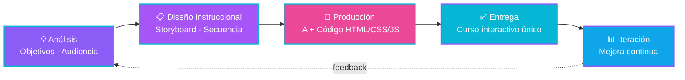

<!-- ====================== BANNER PROPIO ====================== -->
<!-- 👇 Esto carga tu banner amarillo de los LEGOs desde la carpeta assets/ del repo. Debes subir el archivo como assets/banner.png -->

  

<!-- ====================== TYPING ANIMADO ====================== -->

  

<!-- ====================== MANIFIESTO ====================== -->
### 👋 Hola, soy Mau

Diseñador instruccional con **+8 años construyendo e-learning corporativo**. Mi diferencia: combino **diseño instruccional** con **HTML/CSS/JS** y **IA generativa** para crear cursos interactivos únicos en una fracción del tiempo que toma a otros.

Capacité a **+10,000 personas** en una organización y administré una **universidad corporativa** completa. Hoy busco lugares donde la capacitación necesite ir más rápido sin perder calidad.

<!-- ====================== ENLACES PROFESIONALES ====================== -->
## 🌐 Encuéntrame aquí

  
  
  

· También me encuentras aquí ·

  
  
  
  

<!-- ====================== MIS NÚMEROS ====================== -->
## 📊 Mis números

Resultados reales, no métricas de GitHub.

<table align="center">
  <tr>
    <td align="center" width="25%">
       
      <b>Personas capacitadas</b> en una organización
    </td>
    <td align="center" width="25%">
       
      <b>De experiencia</b> construyendo e-learning
    </td>
    <td align="center" width="25%">
       
      <b>Corporativa</b> administrada completa
    </td>
    <td align="center" width="25%">
       
      <b>Herramientas IA</b> dominadas
    </td>
  </tr>
</table>

<!-- ====================== STACK ====================== -->
## 🛠️ Con qué trabajo

**📚 Diseño instruccional & e-learning**

  
  
  
  

**💻 Desarrollo web (frontend)**

  

**🤖 IA generativa — texto, código y agentes**

  
  
  
  
  
  
  

**🎨 IA generativa — imagen y video**

  
  
  

**🎬 Diseño & multimedia**

  
  
  

**🏢 Microsoft 365 & productividad**

  
  

<!-- ====================== CÓMO TRABAJO HOY ====================== -->
## ⚡ Cómo trabajo hoy

Actualmente desarrollo cursos e-learning corporativos en **HTML/CSS/JS** dentro de mi empleo. Mi flujo real combina **diseño instruccional** con **IA generativa para acelerar el desarrollo de código** — domino el qué (estructura del curso, experiencia de aprendizaje, narrativa, criterio visual) y aprovecho la IA para construir el cómo (HTML, interacciones, prototipado) muchísimo más rápido que el flujo tradicional.

> Soy programador en formación que ya entrega resultados reales: cursos interactivos publicados, en tiempos cortos, con un toque visual que se distingue del e-learning genérico.

### 🧭 Mi metodología

**Próximamente:** estoy seleccionando casos de e-learning para publicar aquí como repos abiertos.

<!-- ====================== DASHBOARDS APAGADOS (PROGRESIVOS) ====================== -->
## 📈 Dashboards de actividad

<!-- ====================== CIERRE ====================== -->

  ¿Construimos algo juntos? — Escríbeme por <a href="https://www.linkedin.com/in/mauricio-agapito-herrera/">LinkedIn</a> o <a href="mailto:m_a_u_ricio_1993@hotmail.com">correo</a>.

  

