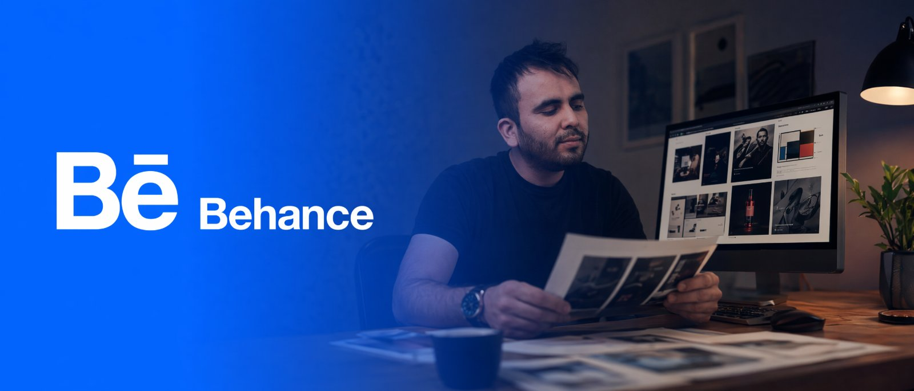
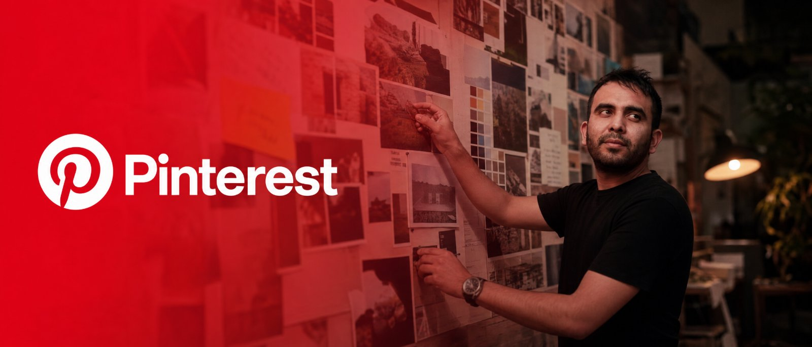
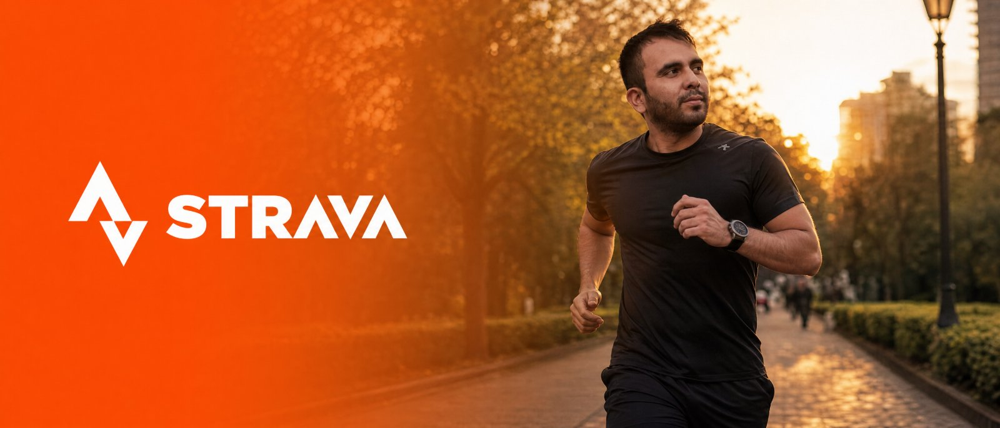
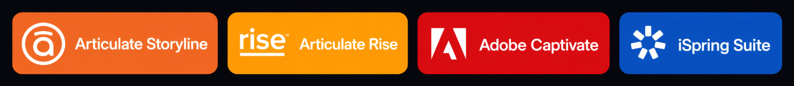
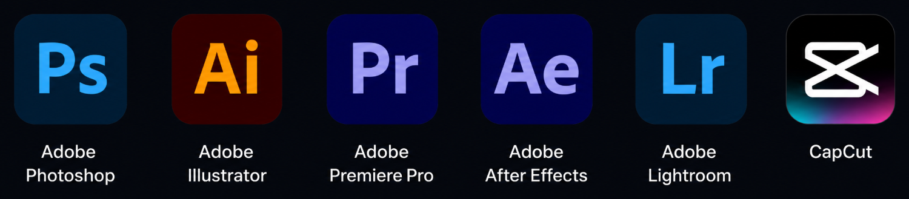
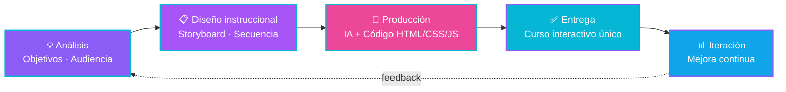

<!-- ====================== BANNER PROPIO (NO TOCAR) ====================== -->
<!-- 👇 Tu banner amarillo de los LEGOs. Se mantiene tal cual. -->

  

<!-- ====================== TYPING ANIMADO ====================== -->

  

<!-- ====================== MANIFIESTO ====================== -->
### 👋 Hola, soy Mau

Diseñador instruccional con **+8 años construyendo e-learning corporativo**. Mi diferencia: combino **diseño instruccional** con **HTML/CSS/JS** e **IA generativa** para crear cursos interactivos únicos en una fracción del tiempo que toma a otros.

Capacité a **+10,000 personas** en una organización y administré una **universidad corporativa** completa. Hoy busco lugares donde la capacitación necesite ir más rápido sin perder calidad.

<!-- ====================== REDES SOCIALES (BANNERS) ====================== -->
## 🌐 Encuéntrame aquí

<table>
  <tr>
    <td width="50%"></td>
    <td width="50%"></td>
  </tr>
  <tr>
    <td width="50%"></td>
    <td width="50%"></td>
  </tr>
  <tr>
    <td width="50%"></td>
    <td width="50%">
      
      
📸 Sin enlace · búscame como <b>@mau.travels_</b>

    </td>
  </tr>
</table>

<!-- ====================== MIS NÚMEROS ====================== -->
## 📊 Mis números

Resultados reales, no métricas de GitHub.

<table align="center">
  <tr>
    <td align="center" width="25%">
       
      <b>Personas capacitadas</b> en una organización
    </td>
    <td align="center" width="25%">
       
      <b>De experiencia</b> construyendo e-learning
    </td>
    <td align="center" width="25%">
       
      <b>Corporativa</b> administrada completa
    </td>
    <td align="center" width="25%">
       
      <b>Herramientas IA</b> dominadas
    </td>
  </tr>
</table>

<!-- ====================== STACK ====================== -->
## 🛠️ Con qué trabajo

**📚 Diseño instruccional & e-learning**

**💻 Desarrollo web (frontend)**

  
  
  

**🤖 IA generativa — texto, código y agentes**

  
  
  
  
  
  
  

**🖼️ IA generativa — imagen**

  
  
  
  
  
  
  
  
  

**🎬 IA generativa — video**

  
  
  
  
  
  
  

**🔊 IA generativa — audio**

  
  

**🎨 Diseño & multimedia**

**🏢 Microsoft 365 & Google**

  
  
  
  
  

<!-- ====================== CÓMO TRABAJO HOY ====================== -->
## ⚡ Cómo trabajo hoy

Actualmente desarrollo cursos e-learning corporativos en **HTML/CSS/JS**. Mi flujo real combina **diseño instruccional** con **IA generativa para acelerar el desarrollo de código** — domino el qué (estructura del curso, experiencia de aprendizaje, narrativa, criterio visual) y aprovecho la IA para construir el cómo (HTML, interacciones, prototipado) muchísimo más rápido que el flujo tradicional.

> Soy programador en formación que ya entrega resultados reales: cursos interactivos publicados, en tiempos cortos, con un toque visual que se distingue del e-learning genérico.

### 🧭 Mi metodología

<!-- ====================== GRÁFICAS (SE LLENAN SOLAS) ====================== -->
## 📈 Mi actividad en GitHub

Esta gráfica lee mi actividad real y se actualiza sola conforme subo cursos.

  

<!-- ====================== CIERRE ====================== -->

  ¿Construimos algo juntos? — Escríbeme por <a href="https://www.linkedin.com/in/mauricio-agapito-herrera/">LinkedIn</a> o <a href="mailto:m_a_u_ricio_1993@hotmail.com">correo</a>.

  

